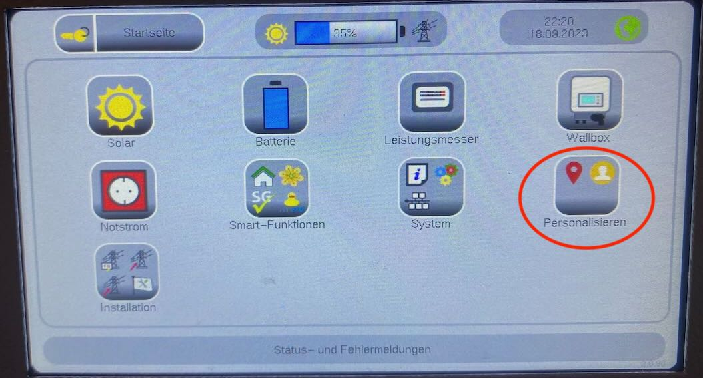
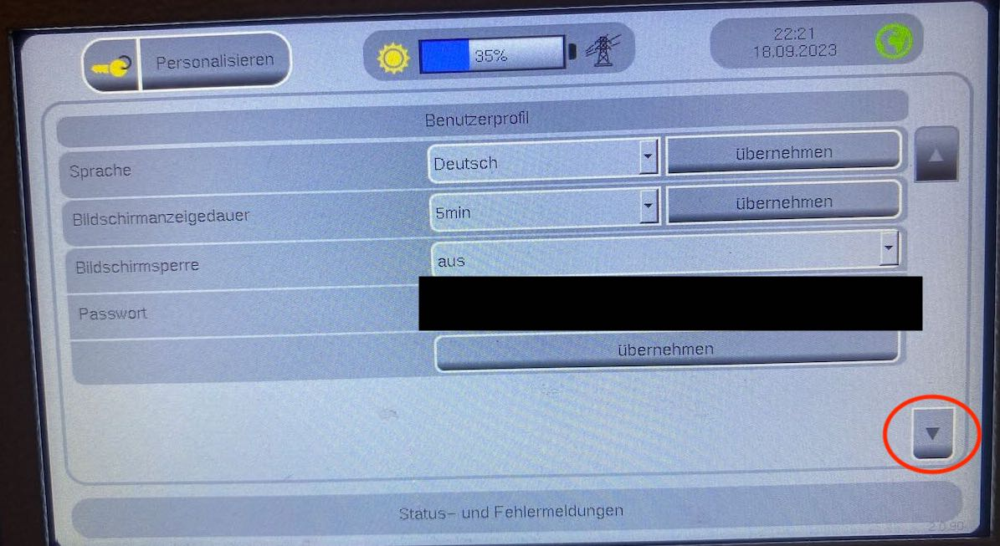
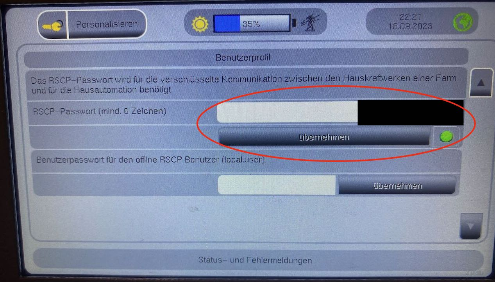

# Setting up the RSCP interface at the home power plant

By default, the RSCP interface is disabled on the home power plant. Therefore you have to go to the home power station once and activate the RSCP interface. Details can be found in the manual of your home power station.

As an example I show the setup on my S10X (On other models it should be similar). The pictures are in german (sorry for that), but it should be easy to adapt.

## Setup on the S10X home power plant

<figure markdown>
  { width=75% }
  <figcaption>Switch from the main page to the main menu</figcaption>
</figure>

<figure markdown>
  { width=75% }
  <figcaption>Select "Personalize" in the main menu</figcaption>
</figure>

<figure markdown>
  { width=75% }
  <figcaption>Select "Profile" here</figcaption>
</figure>

<figure markdown>
  { width=75% }
  <figcaption>Go to the next page</figcaption>
</figure>

<figure markdown>
  { width=75% }
  <figcaption>Set password and confirm -> The small lamp must now light up green</figcaption>
</figure>

## Using the APP

First you need to add an HKW/HPS device. This is the central access point, also for all other devices.

You will need the following data:

- Portal username and password: There is no(!) portal access. The RSCP interface itself, however, requests authentication with the user data on the portal
- RSCP password: This is the password that you have set on the home power station. This is used to encrypt the communication.
- IP: Address of the home power station in your network. Please make sure that your home power station has a fixed IP! You can set this on your router
- Port: The value should actually always be 5033.

